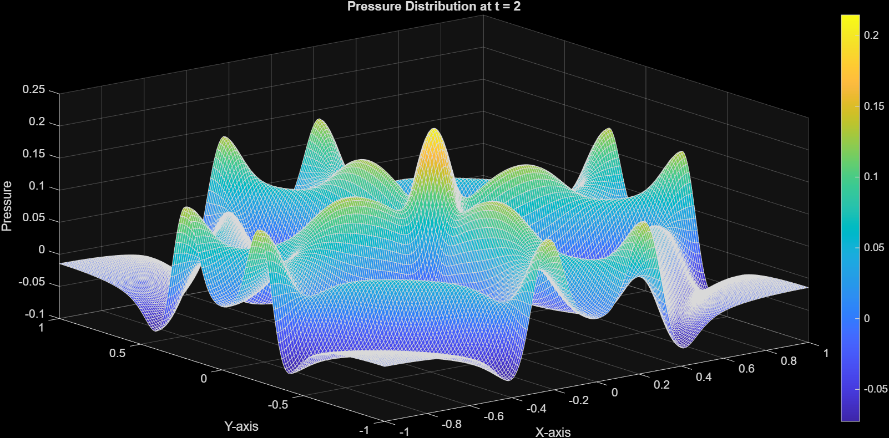

# High-order-acoustics-sbp

High-order **SBP–Projection finite difference methods** for the acoustic wave equation in **1D and 2D**, with emphasis on stability, well-posed boundary conditions, interfaces, convergence studies, and RK4 time integration.

---

## Acoustic Wave Equation – SBP-Projection Methods

- **Course:** 1TD354 – Scientific Computing for Partial Differential Equations  
- **Institution:** Uppsala University  
- **Language:** MATLAB  

---

## 📌 Project Overview

This project investigates the numerical solution of the **acoustic wave equation** in both **one and two spatial dimensions** using **provably stable high-order SBP–Projection finite difference methods**.

The main focus areas are:
- Well-posed boundary and interface conditions  
- Stability via energy estimates and eigenvalue analysis  
- High-order convergence studies  
- Wave propagation in heterogeneous media  

Time integration is performed using the **classical 4th-order Runge–Kutta method (RK4)**.

<p align="center">
  
</p>

---

## 📁 Repository Structure

```text
theory/
├── Assignement 1
├── Assignement 3

Code/
├── Assignement 1
├── Assignement 3

Figures/
├── Assignement 1
├── Assignement 3

```


---

## 🧪 Assignment 1 — 1D Acoustic Wave Equation

This assignment studies the **1D acoustic wave equation** using **high-order SBP-Projection finite difference methods**.  
The focus is on **well-posed boundary conditions**, **energy stability**, **eigenvalue-based stability analysis**, and **high-order convergence** using RK4 time integration.


### Numerical stability study of eigenvalues:


## 🧊 Assignment 3 — Two-Dimensional Acoustic Wave Equation

This assignment extends the SBP-Projection framework to **two spatial dimensions**. The focus is on **well-posedness**, **efficient implementation using Kronecker products**, and **wave propagation in both homogeneous and heterogeneous media**.

---

### 🔹 Task 1: 2D Acoustic Wave Equation on a Square Domain

We solve the two-dimensional acoustic wave equation on the square domain:

$$
\Omega = [-1,\,1] \times [-1,\,1]
$$


The governing equations are:

$$
\mathbf{C} \mathbf{u}_t + \mathbf{A}\ \mathbf{u}_x \+\ \mathbf{B}\ \mathbf{u}_y \+\ \mathbf{D}\ \mathbf{u}\=\ 0
$$


with the solution vector:

$$
\mathbf{u} = 
\begin{bmatrix} p & v & w
\end{bmatrix}^{T}
$$


#### Boundary Conditions
Normal velocity is set to zero on all boundaries:
- $v = 0$ on $\partial\Omega_E \cup \partial\Omega_W$
- $w = 0$ on $\partial\Omega_S \cup \partial\Omega_N$


These boundary conditions are shown to yield a **well-posed initial boundary-value problem**.

#### Initial Conditions

The initial pressure is a centered Gaussian, $p(x,y,0) = e^{-100(x^2 + y^2)}$, with $v(x,y,0) = w(x,y,0) = 0$.  
Material parameters: $\rho = 1$, $c = 1$, $\beta = 0$.

---

### 🔹 Discretization and Numerical Method

The domain is discretized on an **equidistant $m \times m$ grid** with spacing

$$
h = \frac{2}{m-1}.
$$


Two-dimensional operators are constructed using **Kronecker products**:

$$
D_x = D \otimes I, \qquad
D_y = I \otimes D.
$$

The semi-discrete **SBP-Projection formulation** is given by

$$
\mathbf{u}_t
=
- P\, \mathbf{C}^{-1}
\bigl( D_x + D_y + \mathbf{D} \bigr)
P\, \mathbf{u}.
$$

All matrices are stored in **sparse format** to reduce memory usage and computational cost.

- - -

---

### 🔹 Numerical Setup
- SBP operators: **7th order accurate upwind**
- Grid size:
  $$
  m = 200
  $$
- Time integration: **4th order Runge–Kutta (RK4)**
- CFL number: **0.05**

---

### 🔹 Plots to Present

The pressure field is visualized at selected time instances:

$$
p(x,y,t)
$$

```text
figures/assignment3/p_t0.png
figures/assignment3/p_t1.png
figures/assignment3/p_t2.png


